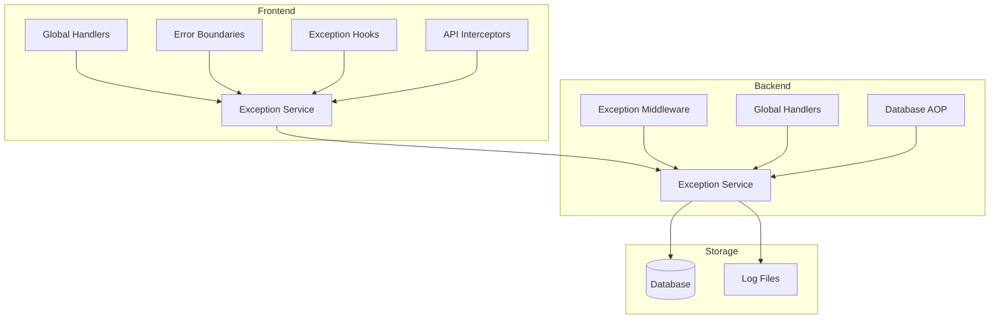
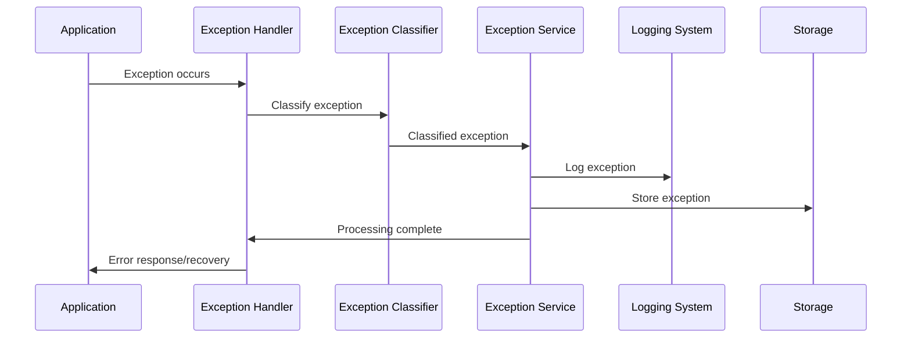

# Exception Handling System Design Document

## Overview

The Exception Handling System is a comprehensive AOP-based solution for capturing, classifying, processing, and reporting exceptions across both frontend and backend components. The system provides automatic exception capture through global handlers, middleware, and React error boundaries, while offering manual exception handling through specialized hooks and decorators.

The system integrates seamlessly with the existing logging infrastructure to provide complete traceability and correlation of exceptions with other system events.

## Architecture

### High-Level Architecture



### Exception Flow



## Components and Interfaces

### Frontend Components

#### 1. Global Exception Handlers
- **Purpose**: Capture unhandled JavaScript errors and Promise rejections
- **Location**: `src/shared/aop/exception/exception.global.js`
- **Interface**:
  ```javascript
  interface GlobalHandlers {
    setupGlobalHandlers(config: GlobalHandlerConfig): void;
    onError(error: Error, context: ErrorContext): void;
    onUnhandledRejection(reason: any): void;
  }
  ```

#### 2. React Error Boundary
- **Purpose**: Capture React component rendering errors
- **Location**: `src/shared/aop/exception/exception.boundary.jsx`
- **Interface**:
  ```javascript
  interface ErrorBoundaryProps {
    fallback: React.ComponentType<ErrorInfo>;
    onError: (error: Error, errorInfo: ErrorInfo) => void;
    children: React.ReactNode;
  }
  ```

#### 3. Exception Hooks
- **Purpose**: Provide context-specific exception handling
- **Location**: `src/shared/aop/hooks/exception/`
- **Interface**:
  ```javascript
  interface ExceptionHook {
    handleException(error: Error, context?: any): void;
    reportException(error: Error, context?: any): Promise<void>;
    getErrorState(): ErrorState;
    clearError(): void;
  }
  ```

#### 4. Exception Service
- **Purpose**: Central service for exception reporting and management
- **Location**: `src/shared/aop/exception/exception.service.js`
- **Interface**:
  ```javascript
  interface ExceptionService {
    reportException(exception: ClassifiedException): Promise<void>;
    classifyException(error: Error, context: any): ClassifiedException;
    batchReportExceptions(exceptions: ClassifiedException[]): Promise<void>;
  }
  ```

### Backend Components

#### 1. Exception Middleware
- **Purpose**: Capture HTTP request/response exceptions
- **Location**: `src/common/modules/exception/middleware.py`
- **Interface**:
  ```python
  class ExceptionMiddleware:
      async def __call__(self, request: Request, call_next: Callable) -> Response:
          # Wrap request processing with exception handling
  ```

#### 2. Global Exception Handlers
- **Purpose**: Handle unhandled exceptions and return appropriate responses
- **Location**: `src/common/modules/exception/handlers.py`
- **Interface**:
  ```python
  async def global_exception_handler(request: Request, exc: Exception) -> JSONResponse:
      # Handle global exceptions
  
  async def validation_exception_handler(request: Request, exc: ValidationError) -> JSONResponse:
      # Handle validation exceptions
  ```

#### 3. Database AOP Wrapper
- **Purpose**: Wrap database operations with exception handling
- **Location**: `src/common/modules/exception/database_aop.py`
- **Interface**:
  ```python
  class ExceptionWrappedClient:
      def __init__(self, client: SupabaseClient):
          self._client = client
      
      def table(self, table_name: str) -> ExceptionWrappedTable:
          # Return wrapped table with exception handling
  ```

#### 4. Exception Service
- **Purpose**: Record and manage backend exceptions
- **Location**: `src/common/modules/exception/service.py`
- **Interface**:
  ```python
  class ExceptionService:
      async def record_exception(self, exception: Exception, context: dict) -> None:
          # Record exception with full context
      
      async def classify_exception(self, exception: Exception) -> ClassifiedException:
          # Classify exception type
  ```

## Data Models

### Exception Data Model

```python
@dataclass
class ExceptionRecord:
    id: UUID
    source: str  # "frontend" | "backend"
    level: str  # "ERROR" | "CRITICAL"
    layer: str  # "Exception"
    message: str
    file: Optional[str]
    line: Optional[int]
    function: Optional[str]
    trace_id: Optional[UUID]
    request_id: Optional[str]
    user_id: Optional[UUID]
    created_at: datetime
    exception_type: str
    stack_trace: Optional[str]
    context: dict
    http_status: Optional[int]
    resolved: bool = False
    resolution_notes: Optional[str] = None
```

### Exception Classification

```python
class ExceptionType(Enum):
    # Frontend
    NETWORK_ERROR = "NetworkError"
    API_ERROR = "ApiError"
    VALIDATION_ERROR = "ValidationError"
    AUTH_ERROR = "AuthError"
    RENDER_ERROR = "RenderError"
    RUNTIME_ERROR = "RuntimeError"
    
    # Backend
    AUTHENTICATION_ERROR = "AuthenticationError"
    AUTHORIZATION_ERROR = "AuthorizationError"
    NOT_FOUND_ERROR = "NotFoundError"
    CONFLICT_ERROR = "ConflictError"
    RATE_LIMIT_ERROR = "RateLimitError"
    DATABASE_ERROR = "DatabaseError"
    EXTERNAL_SERVICE_ERROR = "ExternalServiceError"
    INTERNAL_ERROR = "InternalError"
```

### Exception Context Models

```python
@dataclass
class NetworkErrorContext:
    url: str
    method: str
    timeout: Optional[int]
    connection_error: str

@dataclass
class ApiErrorContext:
    url: str
    method: str
    status_code: int
    response_body: Optional[str]
    request_body: Optional[str]

@dataclass
class DatabaseErrorContext:
    table_name: str
    operation: str
    query: Optional[str]
    connection_info: dict
```

## Correctness Properties

*A property is a characteristic or behavior that should hold true across all valid executions of a system-essentially, a formal statement about what the system should do. Properties serve as the bridge between human-readable specifications and machine-verifiable correctness guarantees.*

### Property Reflection

After reviewing all properties identified in the prework analysis, I've identified several areas where properties can be consolidated:

**Redundancy Elimination:**
- Properties 1.1-1.6 (frontend exception classification) can be combined into a single comprehensive property about frontend exception classification
- Properties 2.1-2.9 (backend exception classification) can be combined into a single comprehensive property about backend exception classification and HTTP status mapping
- Properties 3.1-3.5 (frontend global capture) can be combined into a single property about global exception capture
- Properties 4.1-4.5 (backend global handling) can be combined into a single property about global exception handling
- Properties 5.1-5.7 (exception context) can be combined into a single property about exception context completeness
- Properties 6.1-6.5 (hook interfaces) are examples rather than properties and can be combined into a single interface validation
- Properties 7.1-7.5 (middleware behavior) can be combined into a single property about middleware exception handling
- Properties 8.1-8.6 (database AOP) can be combined into a single property about database exception handling
- Properties 9.1-9.5 (response format) can be combined into a single property about response standardization
- Properties 10.1-10.5 (recovery mechanisms) can be combined into a single property about graceful degradation
- Properties 11.1-11.5 (monitoring) can be combined into a single property about exception monitoring
- Properties 12.1-12.5 (performance) can be combined into a single property about performance impact

**Consolidated Properties:**

Property 1: Frontend Exception Classification and Capture
*For any* frontend error (network, API, validation, auth, render, runtime), the exception system should correctly classify it by type and capture all relevant context information
**Validates: Requirements 1.1, 1.2, 1.3, 1.4, 1.5, 1.6**

Property 2: Backend Exception Classification and HTTP Mapping
*For any* backend exception, the system should classify it correctly and return the appropriate HTTP status code (400 for validation, 401 for auth, 403 for authorization, 404 for not found, 409 for conflict, 429 for rate limit, 500 for database/internal, 502 for external service)
**Validates: Requirements 2.1, 2.2, 2.3, 2.4, 2.5, 2.6, 2.7, 2.8, 2.9**

Property 3: Global Exception Capture Completeness
*For any* unhandled exception (JS errors, Promise rejections, React errors, API failures), the global handlers should capture it and report it to the exception service with full context
**Validates: Requirements 3.1, 3.2, 3.3, 3.4, 3.5**

Property 4: Backend Global Exception Processing
*For any* unhandled backend exception, the global handlers should capture it, determine appropriate HTTP status, and record it with full context
**Validates: Requirements 4.1, 4.2, 4.3, 4.4, 4.5**

Property 5: Exception Context Completeness
*For any* exception, the system should include complete context information: source, trace_id, request_id, user_id (if available), file/line/function, timestamp, exception type, stack trace, and type-specific context
**Validates: Requirements 5.1, 5.2, 5.3, 5.4, 5.5, 5.6, 5.7**

Property 6: Exception Hook Interface Consistency
*For any* exception hook (useAuthException, useStoreException, useComponentException, useHookException, usePerformanceException), it should provide consistent methods for handling and reporting exceptions
**Validates: Requirements 6.1, 6.2, 6.3, 6.4, 6.5, 6.6**

Property 7: Middleware Exception Handling
*For any* HTTP request that throws an exception, the middleware should wrap it in try-catch, capture full context, determine appropriate status code, include correlation IDs, and record via exception service
**Validates: Requirements 7.1, 7.2, 7.3, 7.4, 7.5**

Property 8: Database AOP Exception Handling
*For any* database operation (INSERT, UPDATE, DELETE, SELECT, connection) that fails, the AOP wrapper should capture it as DatabaseError with operation context and record via exception service
**Validates: Requirements 8.1, 8.2, 8.3, 8.4, 8.5, 8.6**

Property 9: Exception Response Format Standardization
*For any* exception response, it should include standardized error object with type/message/code, field-specific details for validation, auth-specific codes for authentication, correlation IDs, and timestamp/context
**Validates: Requirements 9.1, 9.2, 9.3, 9.4, 9.5**

Property 10: Graceful Exception Recovery
*For any* exception (component crash, API failure, auth failure, network error, critical error), the system should provide appropriate recovery mechanisms (fallback UI, retry, redirect, offline mode, safe recovery)
**Validates: Requirements 10.1, 10.2, 10.3, 10.4, 10.5**

Property 11: Exception Monitoring and Analysis
*For any* captured exception, the system should aggregate by type/frequency, trigger alerts for critical exceptions, provide trend analysis, integrate with logging, and make data available for querying
**Validates: Requirements 11.1, 11.2, 11.3, 11.4, 11.5**

Property 12: Exception Processing Performance
*For any* exception processing (capture, context collection, reporting, handler registration, processing failures), it should use asynchronous processing, limit data size, batch reporting, minimize performance impact, and maintain system stability
**Validates: Requirements 12.1, 12.2, 12.3, 12.4, 12.5**

## Error Handling

### Exception Classification Strategy

The system uses a hierarchical classification approach:

1. **Source Classification**: Frontend vs Backend
2. **Type Classification**: Based on exception characteristics
3. **Severity Classification**: ERROR vs CRITICAL
4. **Context Classification**: Layer-specific context collection

### Recovery Mechanisms

#### Frontend Recovery
- **Component Crashes**: Error boundaries with fallback UI
- **API Failures**: Retry mechanisms with exponential backoff
- **Authentication Failures**: Automatic token refresh or redirect to login
- **Network Errors**: Offline mode with cached data
- **Validation Errors**: Field-level error display with correction guidance

#### Backend Recovery
- **Database Failures**: Connection pooling and retry logic
- **External Service Failures**: Circuit breaker pattern
- **Rate Limiting**: Backoff and queue mechanisms
- **Validation Errors**: Structured error responses with field details

### Exception Correlation

All exceptions are correlated using:
- **trace_id**: Links exceptions across frontend/backend for the same user session
- **request_id**: Links exceptions to specific API requests
- **user_id**: Links exceptions to specific users for pattern analysis
- **timestamp**: Enables temporal correlation and sequence analysis

## Testing Strategy

### Unit Testing Approach

Unit tests will focus on:
- Exception classification accuracy
- Context collection completeness
- Handler registration and invocation
- Recovery mechanism functionality
- Integration points with logging system

### Property-Based Testing Approach

The system will use **Hypothesis** for Python backend and **fast-check** for JavaScript frontend property-based testing. Each property-based test will run a minimum of 100 iterations to ensure comprehensive coverage.

**Property-Based Testing Requirements:**
- Each correctness property must be implemented by a single property-based test
- Each test must be tagged with the format: `**Feature: exception-handling, Property {number}: {property_text}**`
- Tests must generate diverse exception scenarios to validate universal properties
- Backend tests will use Hypothesis for generating random exception conditions
- Frontend tests will use fast-check for generating random error scenarios

**Test Coverage Strategy:**
- **Property Tests**: Verify universal behaviors across all exception types and scenarios
- **Unit Tests**: Verify specific examples, edge cases, and integration points
- **Integration Tests**: Verify end-to-end exception flow from capture to storage
- **Performance Tests**: Verify exception handling doesn't degrade system performance

The dual testing approach ensures both concrete functionality (unit tests) and universal correctness (property tests) are validated comprehensively.