# 창업톡 고도화 수정_V3_20260126

**Source:** `창업톡 고도화 수정_V3_20260126.pptx`

---

## Slide 1: 

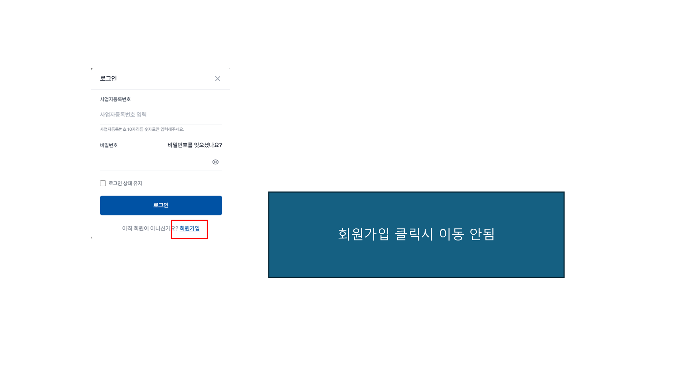

### 📝 Text Content

회원가입 클릭시 이동 안됨

---

## Slide 2: 

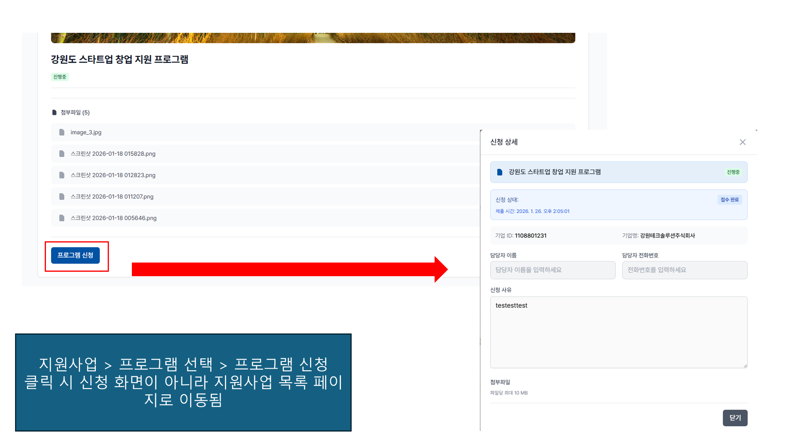

### 📝 Text Content

- 지원사업 > 프로그램 선택 > 프로그램 신청
- 클릭 시 신청 화면이 아니라 지원사업 목록 페이지로 이동됨

---

## Slide 3: 

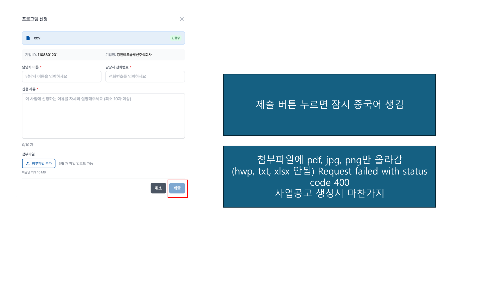

### 📝 Text Content

제출 버튼 누르면 잠시 중국어 생김
- 첨부파일에 pdf, jpg, png만 올라감
- (hwp, txt, xlsx 안됨) Request failed with status code 400사업공고 생성시 마찬가지

---

## Slide 4: 

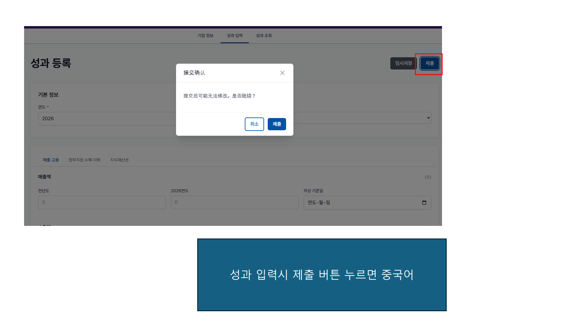

### 📝 Text Content

성과 입력시 제출 버튼 누르면 중국어

---

## Slide 5: 

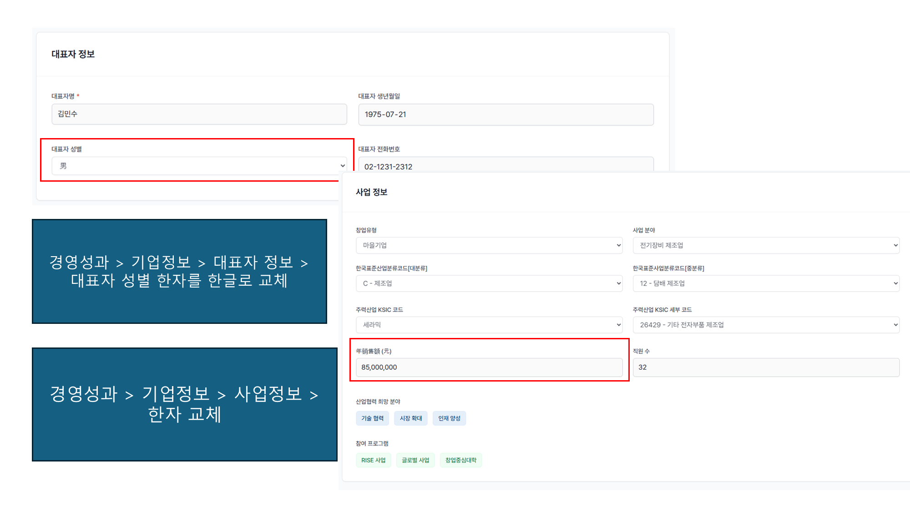

### 📝 Text Content

경영성과 > 기업정보 > 대표자 정보 > 대표자 성별 한자를 한글로 교체
경영성과 > 기업정보 > 사업정보 > 한자 교체

---

## Slide 6: 

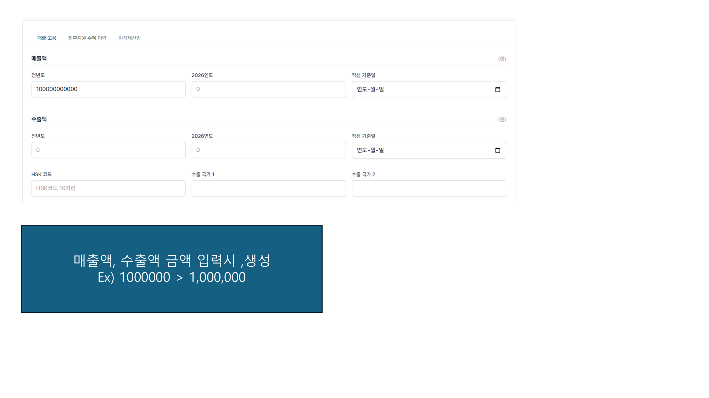

### 📝 Text Content

- 매출액, 수출액 금액 입력시 ,생성
- Ex) 1000000 > 1,000,000

---

## Slide 7: 

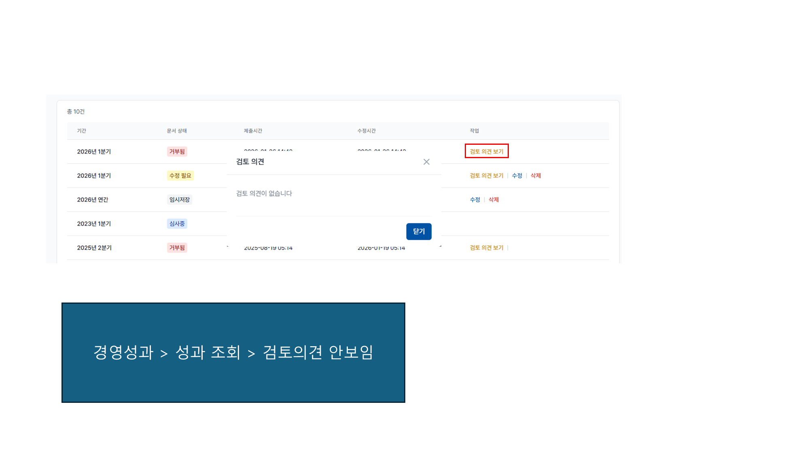

### 📝 Text Content

경영성과 > 성과 조회 > 검토의견 안보임

---

## Slide 8: 

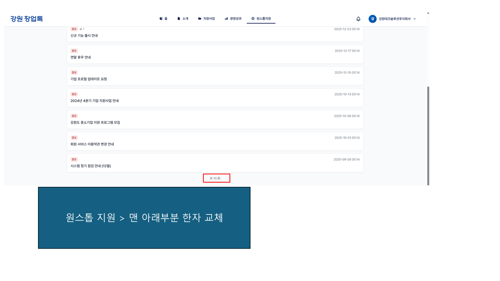

### 📝 Text Content

원스톱 지원 > 맨 아래부분 한자 교체

---

## Slide 9: 

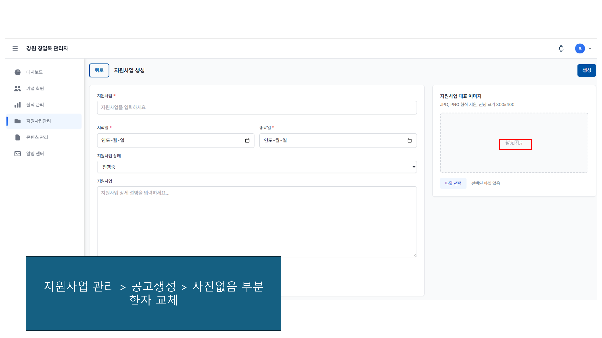

### 📝 Text Content

- 지원사업 관리 > 공고생성 > 사진없음 부분
- 한자 교체

---

## Slide 10: 

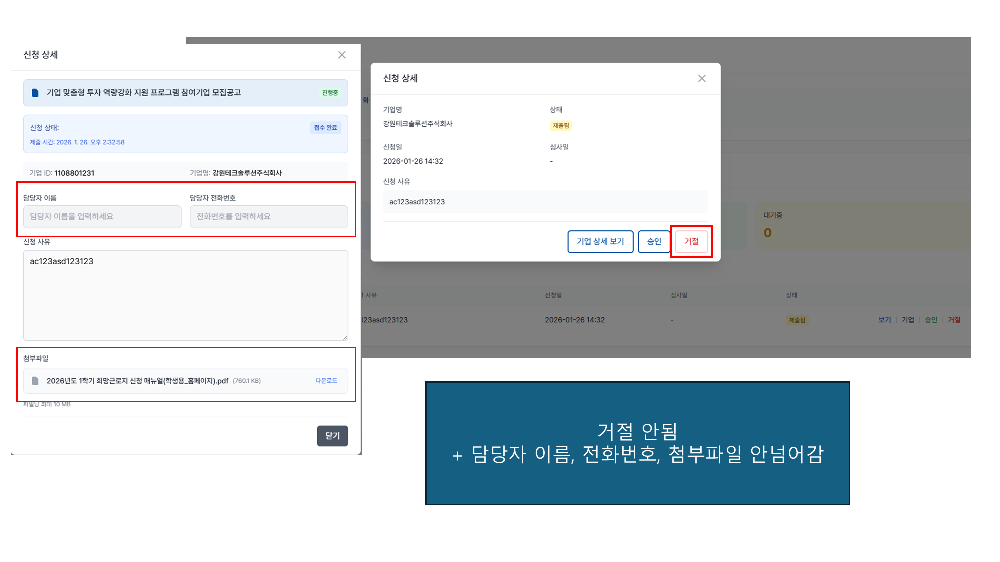

### 📝 Text Content

- 거절 안됨
- + 담당자 이름, 전화번호, 첨부파일 안넘어감

---

## Slide 11: 

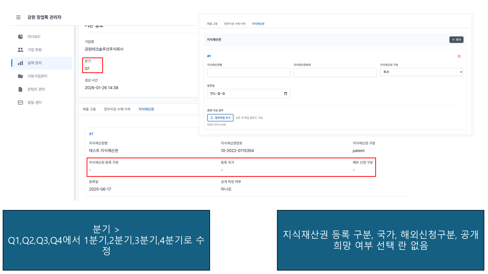

### 📝 Text Content

- 분기 >
- Q1,Q2,Q3,Q4에서 1분기,2분기,3분기,4분기로 수정
지식재산권 등록 구분, 국가, 해외신청구분, 공개희망 여부 선택 란 없음

---

## Slide 12: 

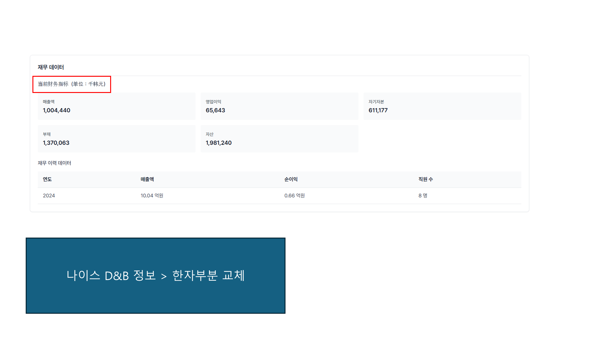

### 📝 Text Content

나이스 D&B 정보 > 한자부분 교체

---

## Slide 13: 

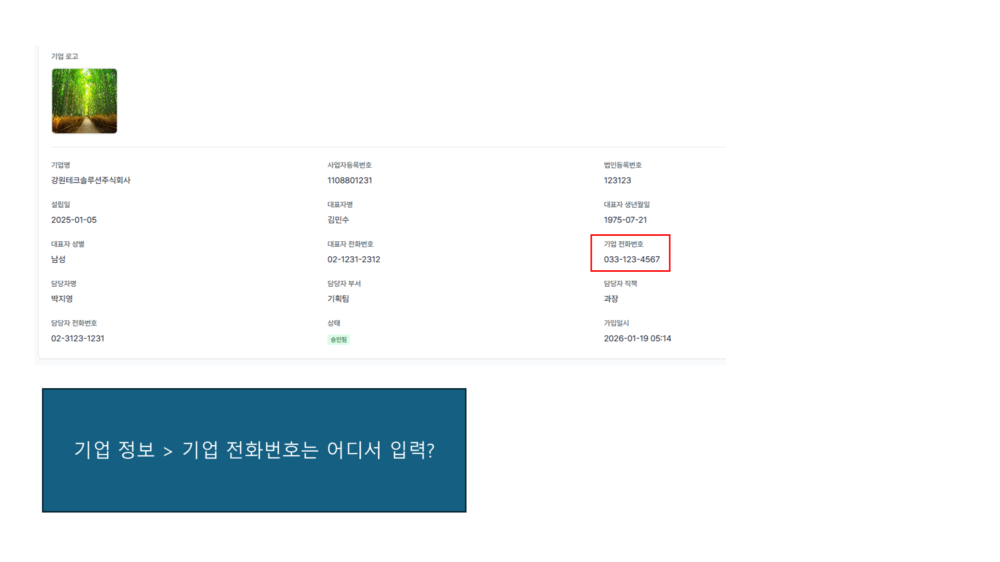

### 📝 Text Content

기업 정보 > 기업 전화번호는 어디서 입력?

---

## Slide 14: 

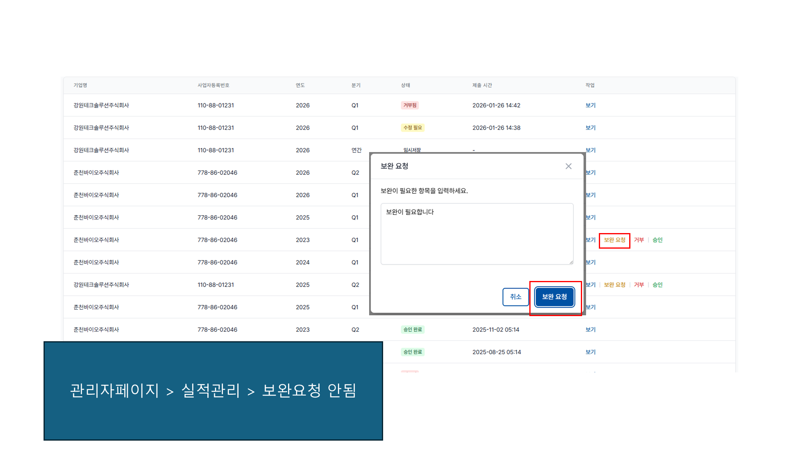

### 📝 Text Content

관리자페이지 > 실적관리 > 보완요청 안됨

---
