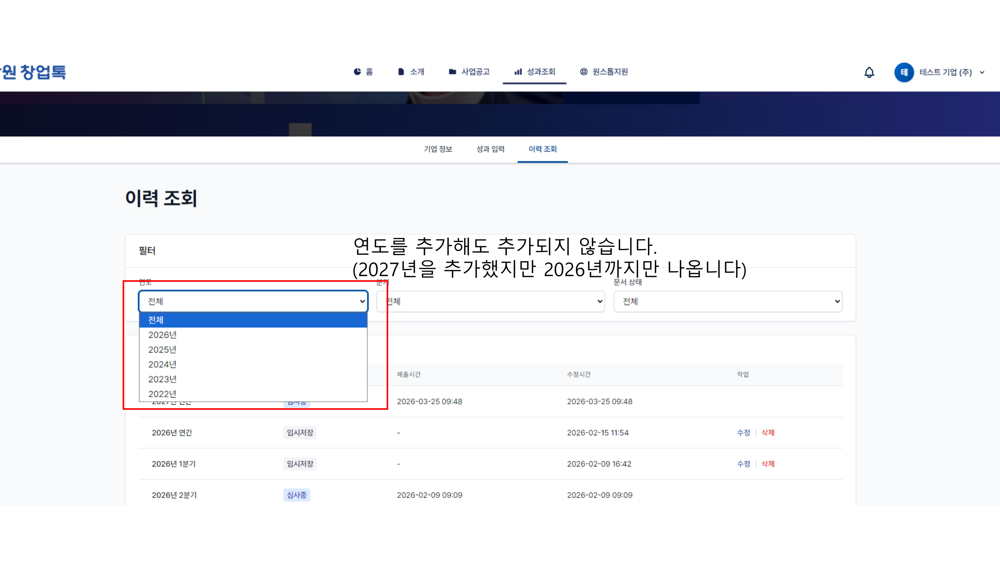
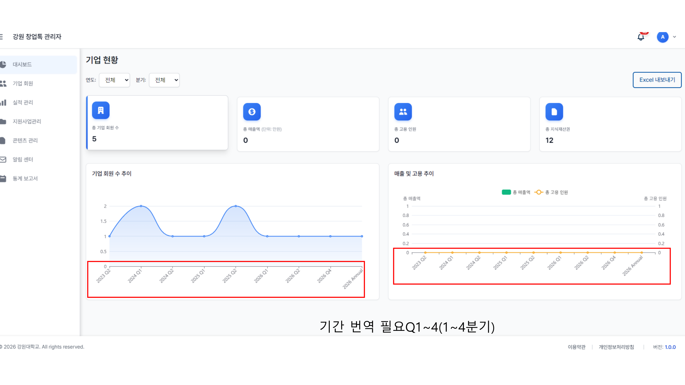
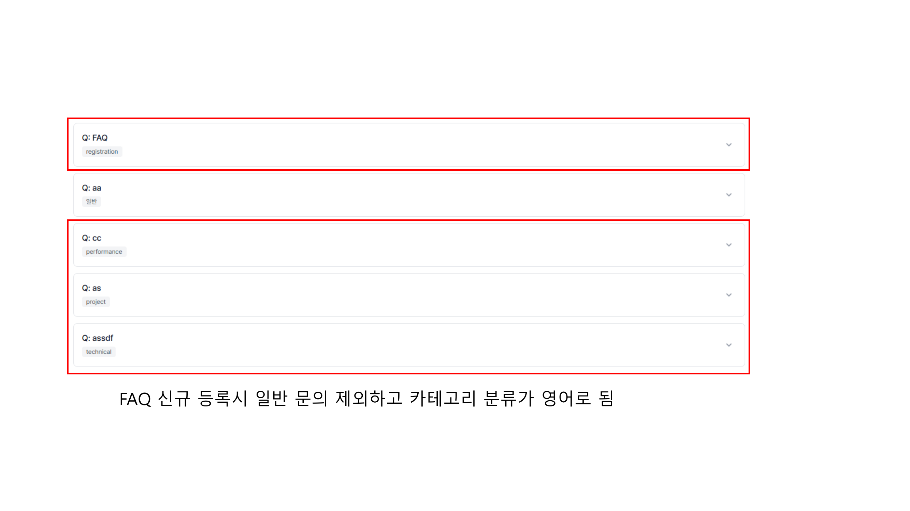
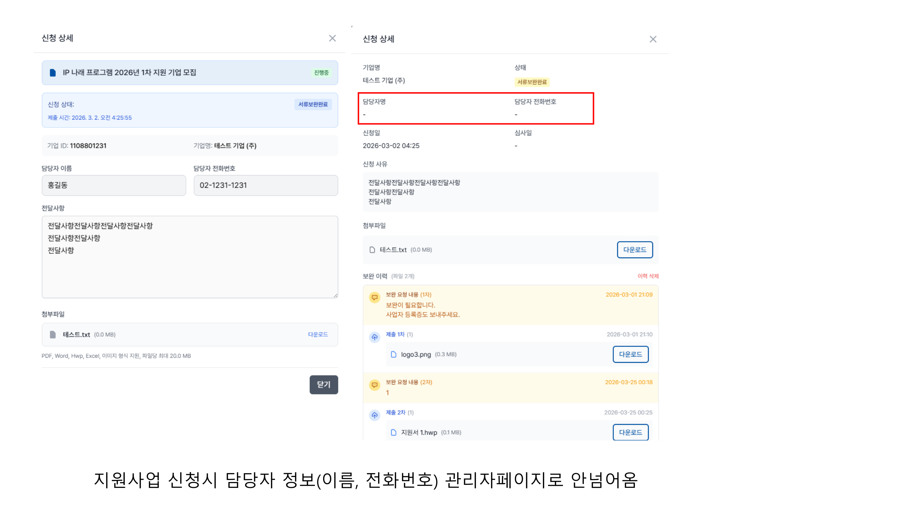
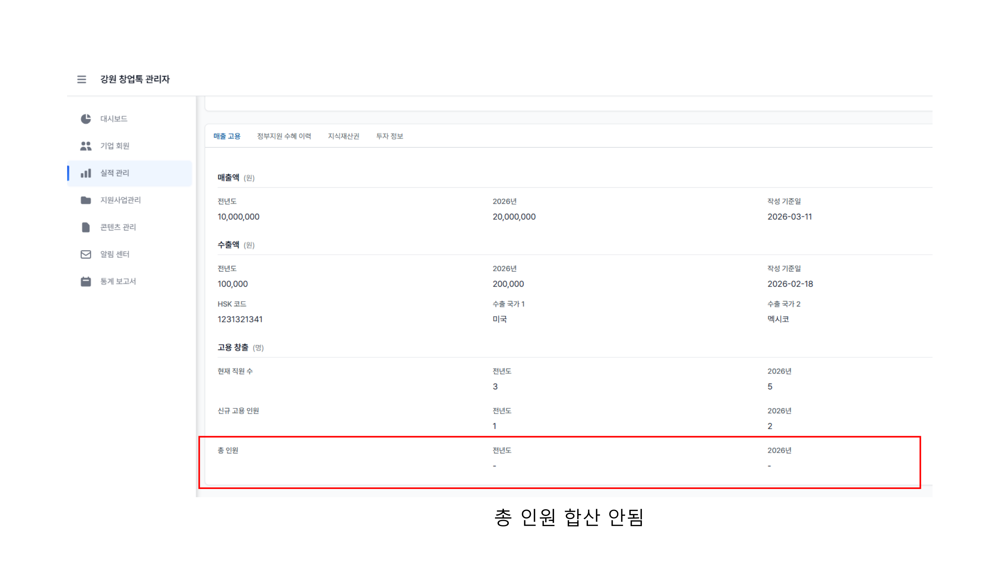

# 창업톡 수정사항 260331

**Source:** `창업톡 수정사항_260331.pdf`  
**Total Pages:** 5  
**Format:** Page Image + OCR Text

---

## Page 1

### 📷 Page Image

### ✍️ Notes

> **需求 #1**: 이력 조회 연도 필터에 2027년 추가해도 표시되지 않음
> **原文**: 연도를 추가해도 추가되지 않습니다. (2027년을 추가했지만 2026년까지만 나옵니다)
> **翻译**: 添加年度后不会显示。（添加了2027年，但只显示到2026年）
> **涉及文件**:
> - `frontend/src/member/modules/performance/components/PerformanceList/PerformanceList.jsx` (L89-98) - 年份选项硬编码为 `new Date().getFullYear() - i`，只生成当前年份及之前5年
> **实施**: ⬜ 未开始
> **优先级**: 🔴 高

---

## Page 2

### 📷 Page Image

### ✍️ Notes

> **需求 #2**: 관리자 대시보드 그래프 X축 기간 번역 필요 (Q1~4 → 1~4분기)
> **原文**: 기간 번역 필요Q1~4(1~4분기)
> **翻译**: 图表X轴的期间标签需要翻译，Q1~Q4 应显示为 1~4분기
> **涉及文件**:
> - `backend/src/modules/dashboard/service.py` (L185-189) - `period_label` 使用硬编码英文 `Q{quarter}` / `Annual`
> - `frontend/src/admin/modules/dashboard/locales/ko.json` - 已有翻译键但未使用
> **实施**: ⬜ 未开始
> **优先级**: 🟡 中

---

## Page 3

### 📷 Page Image

### ✍️ Notes

> **需求 #3**: FAQ 분류 카테고리가 영어로 표시됨 (registration, performance, project, technical)
> **原文**: FAQ 신규 등록시 일반 문의 제외하고 카테고리 분류가 영어로 됨
> **翻译**: 新注册FAQ时，除"一般咨询"外，分类名称显示为英文（registration, performance, project, technical）
> **涉及文件**:
> - `frontend/src/member/modules/support/enums.js` (L10-18) - `FAQ_CATEGORIES` 枚举值不一致（REGISTRATION 是 "회원가입"，但 GENERAL 是 "general"）
> - `frontend/src/member/modules/support/hooks/useFAQ.js` (L51-62) - `categoryTranslations` 映射中没有覆盖 `registration`、`performance`、`project`、`technical` 这些英文键
> - `frontend/src/member/modules/support/components/FAQPage/FAQItem.jsx` (L41) - 使用 `categoryTranslations[faq.category]` 翻译
> - 后端 FAQ 创建时使用英文 category key（registration, performance, project, technical），但前端翻译映射只覆盖了韩文值
> **实施**: ⬜ 未开始
> **优先级**: 🔴 高

---

## Page 4

### 📷 Page Image

### ✍️ Notes

> **需求 #4**: 지원사업 신청시 담당자 정보(이름, 전화번호)가 관리자 페이지에 표시되지 않음
> **原文**: 지원사업 신청시 담당자 정보(이름, 전화번호) 관리자페이지로 안넘어옴
> **翻译**: 申请支援事业时，负责人信息（姓名、电话）未传递到管理员页面
> **涉及文件**:
> - `frontend/src/admin/modules/projects/ProjectDetail.jsx` (L831-843) - 模态框使用 `contactPersonName` 和 `contactPhone`
> - `backend/src/modules/project/service.py` (L190, L835) - 后端存储为 `applicant_name` 和 `applicant_phone`
> - API 服务自动 snake→camelCase 转换后变为 `applicantName` 和 `applicantPhone`
> - 前端模态框使用错误的字段名 `contactPersonName` 而非 `applicantName`
> **实施**: ⬜ 未开始
> **优先级**: 🔴 高

---

## Page 5

### 📷 Page Image

### ✍️ Notes

> **需求 #5**: 관리자 실적 관리 매출 고용 탭에서 총 인원 합산이 안됨
> **原文**: 총 인원 합산 안됨
> **翻译**: 总人员未合算（"总人员"行的前年度和当年值显示为"-"）
> **涉及文件**:
> - `frontend/src/admin/modules/performance/components/SalesEmploymentTab.jsx` (L214-243) - 总人员行显示 `salesEmployment.employment?.totalEmployees?.previousYear/currentYear`，但会员端表单提交时未自动计算该值
> - `frontend/src/member/modules/performance/hooks/usePerformanceForm.js` (L44) - `totalEmployees` 初始为空字符串，没有自动计算逻辑
> - 需要在会员端表单提交/保存时自动计算 `totalEmployees = currentEmployees + newEmployees`
> **实施**: ⬜ 未开始
> **优先级**: 🔴 高

---
