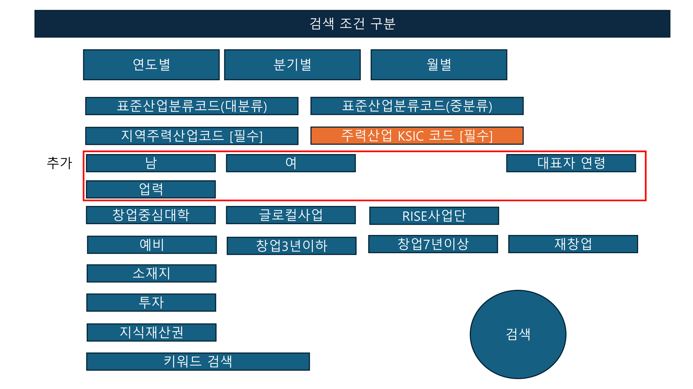
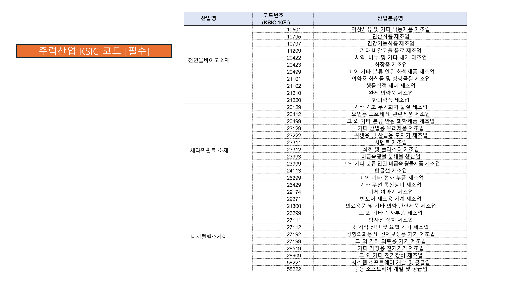
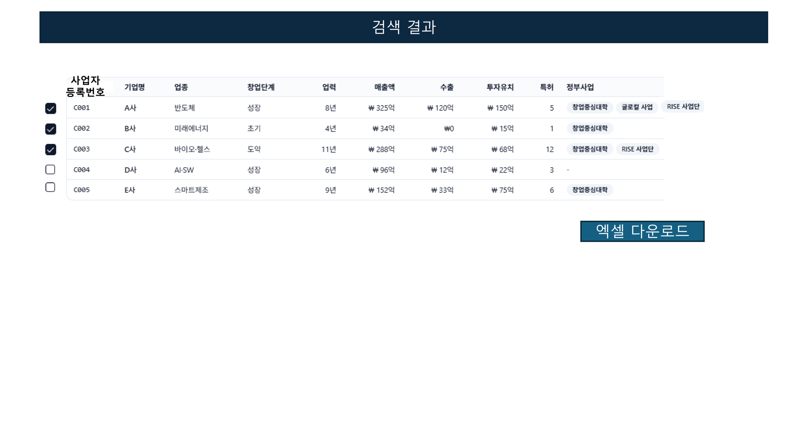

# 통계리포트 형식

**Source:** `통계리포트 형식.pdf`  
**Total Pages:** 4  
**Format:** Page Image + OCR Text

---

## Page 1

### 📷 Page Image

### ✍️ Notes

> [Add your notes here]

---

## Page 2

### 📷 Page Image

### ✍️ Notes

> [Add your notes here]

---

## Page 3

### 📷 Page Image

### ✍️ Notes

> [Add your notes here]

---

## Page 4

### 📷 Page Image

### ✍️ Notes

> [Add your notes here]

---
